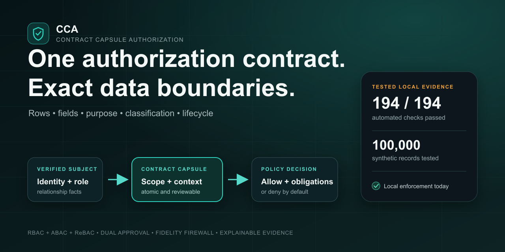
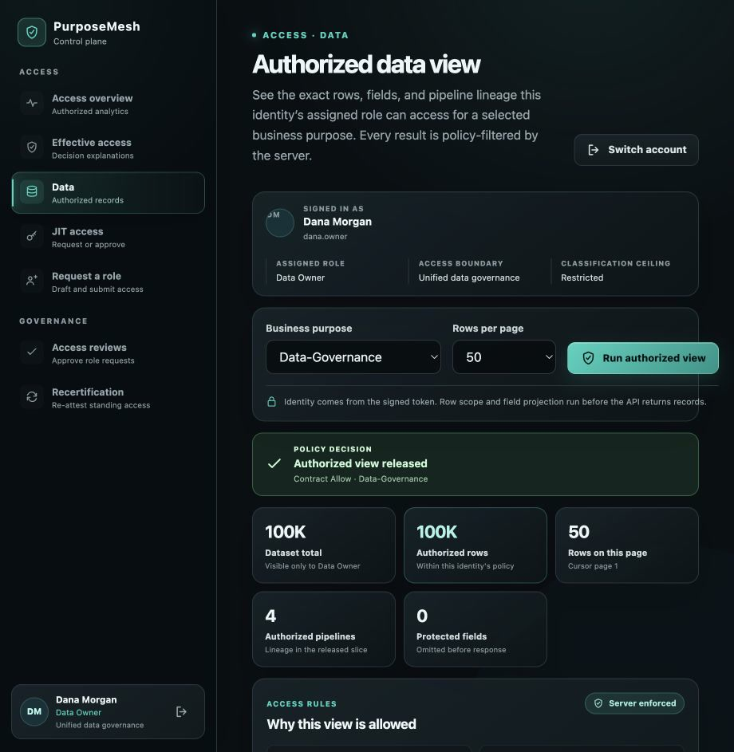
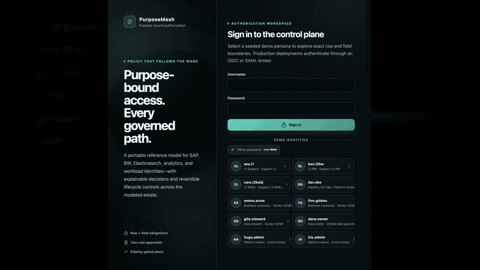
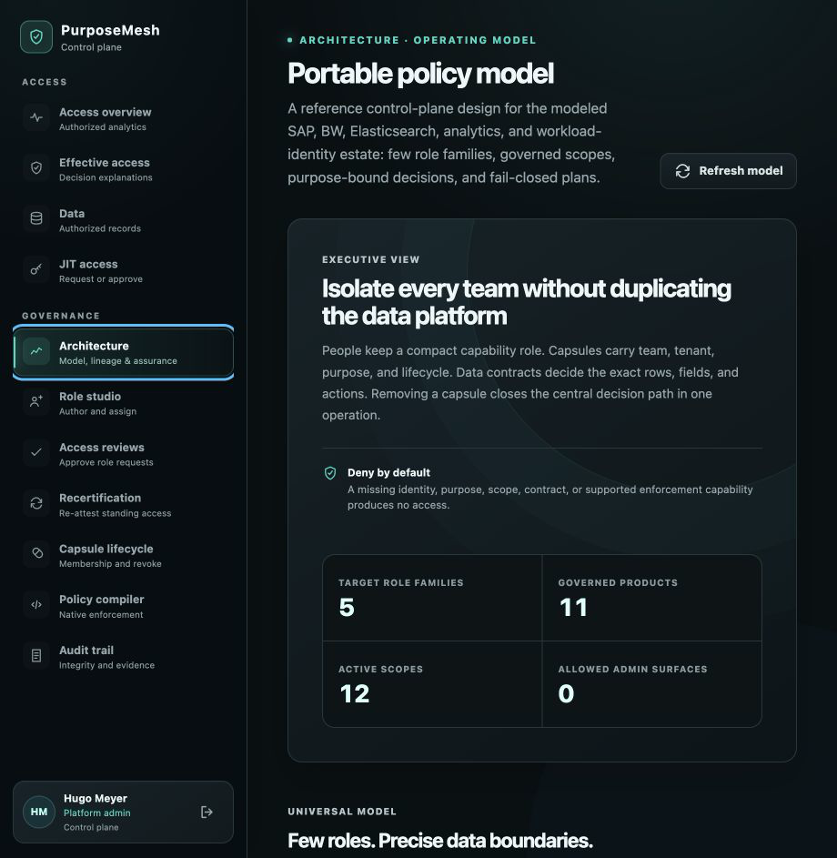
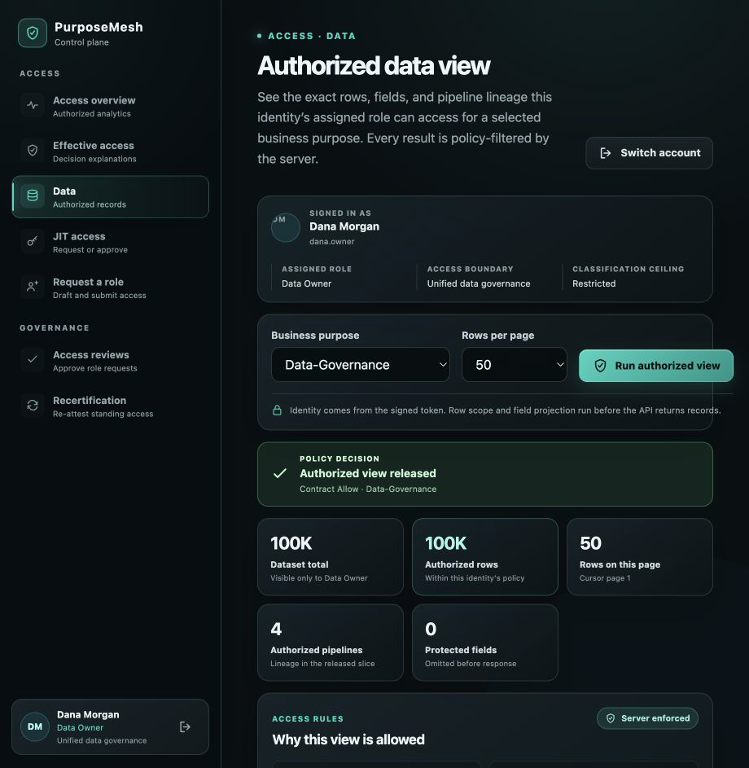
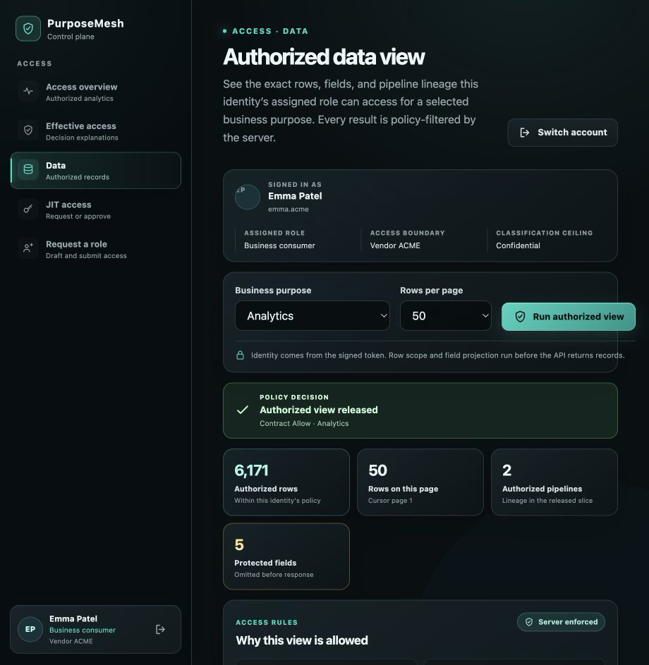
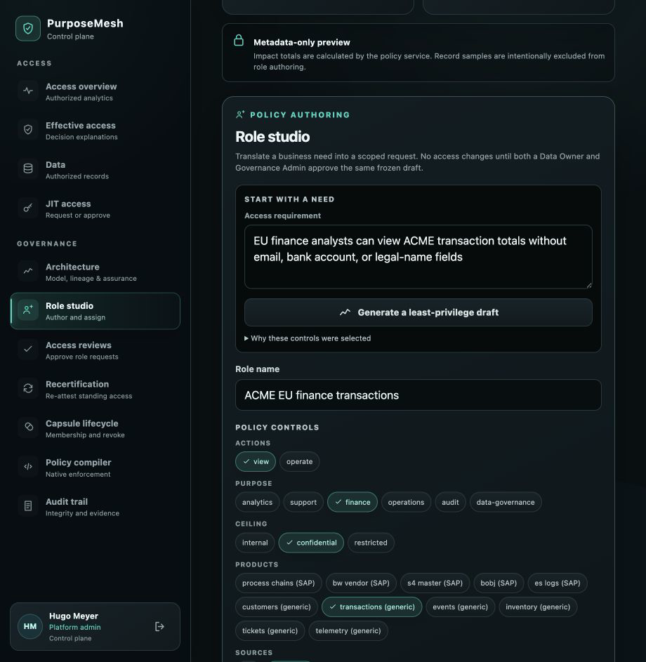
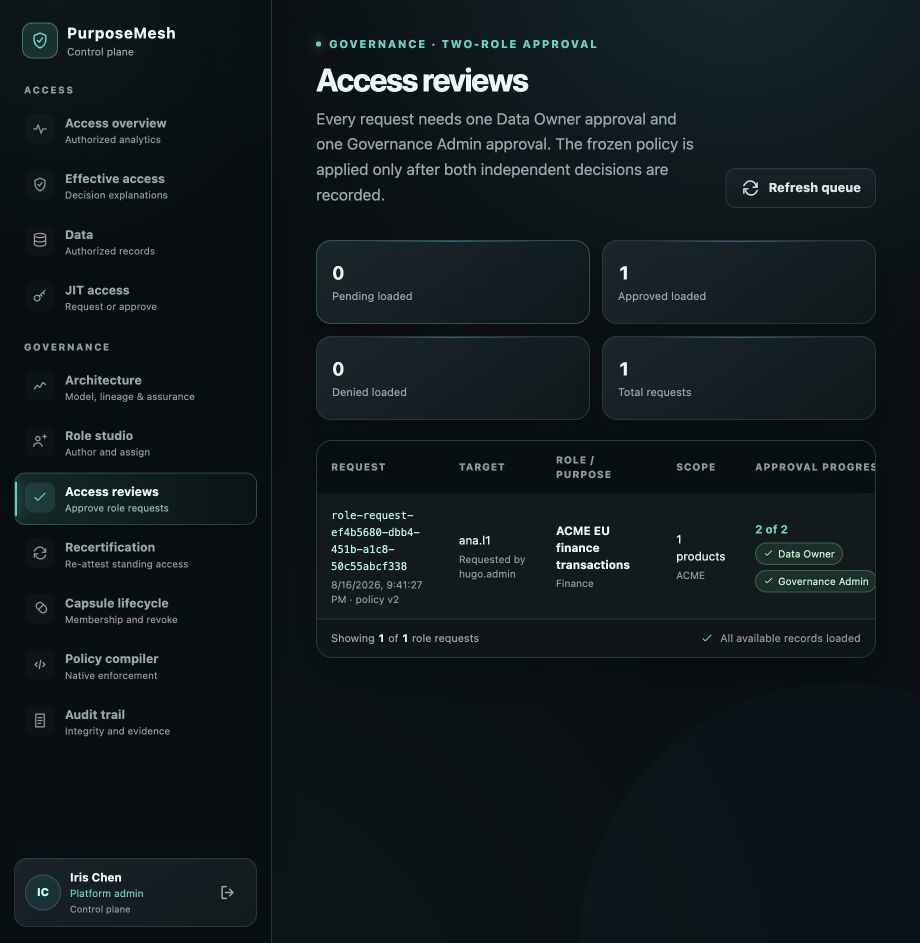
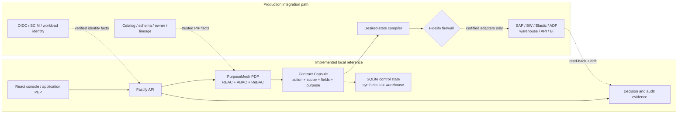
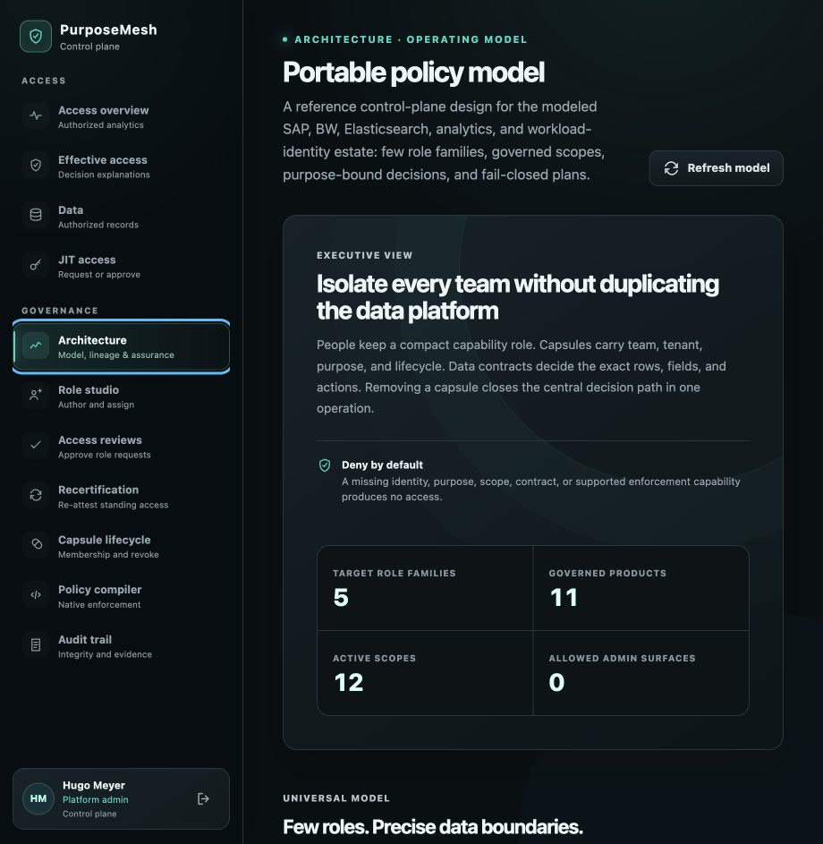

# PurposeMesh

<p align="center"><strong>Purpose-bound access, enforced everywhere.</strong></p>

<p align="center"><em>Implemented today in the local React/Fastify/PDP/SQLite path; external enforcement requires certified adapters, target apply, and verified read-back.</em></p>

<p align="center">
  <a href="https://github.com/mkbhardwas12/purposemesh/actions/workflows/ci.yml"></a>
  
  
  <a href="LICENSE"></a>
</p>



PurposeMesh is a purpose-bound authorization control-plane reference for shared data.
It combines a small RBAC capability vocabulary with ABAC scope and ReBAC
relationships, then returns server-enforced row, field, purpose, classification,
and lifecycle obligations.

Its core policy envelope is a **Contract Capsule**: one reviewable unit that
keeps action, data scope, fields, purpose, conditions, approvals, and expiry
together as policy moves across applications and platforms.

| Tested evidence | Precise boundary | Governed lifecycle |
|---|---|---|
| End-to-end tests use a deterministic **100,000-record synthetic dataset** across four modeled source pipelines. | Data Owner sees the approved complete scope; vendors see only their tenant slice; platform admins see no business rows. | Independent Data Owner + Governance Admin approval, bounded JIT, recertification evidence, and one local desired-state offboarding action; external removal still requires certified connectors and matching target read-back. |

**Explore:** [90-second demo](#90-second-demo) ·
[architecture](docs/ARCHITECTURE.md) ·
[security model](docs/SECURITY.md) ·
[complete public brief](docs/purposemesh-complete-brief.html) ·
[executive architecture briefing](docs/PurposeMesh-Executive-Architecture-Briefing.pptx) ·
[contributing](CONTRIBUTING.md)

> [!IMPORTANT]
> PurposeMesh is a working, single-node reference implementation and bounded pilot
> candidate—not a finished enterprise security product. The React/Fastify/PDP/
> SQLite path enforces local policy now. SAP, BW, Elasticsearch, ADF, BI, IdP,
> catalog, lineage, apply, read-back, and drift integrations remain blocked or
> preview-only until certified adapters prove fidelity.

## 90-second demo

Requirements: Node.js 24+ and npm 11+.

```bash
git clone https://github.com/mkbhardwas12/purposemesh.git
cd purposemesh
npm ci
npm run dev
```

Open <http://127.0.0.1:5173>, use demo password `cca-demo`, then compare:

1. `dana.owner` — complete approved synthetic-data scope.
2. `emma.acme` — ACME rows only; protected account fields remain absent.
3. `finn.globex` — GLOBEX rows only.
4. `hugo.admin` or `iris.admin` — governance controls, zero business-data rows.

After signing in, open **Access → Data**, choose **Run authorized view**, and
compare each identity's server-authorized scope. The 100,000-record fixture is
test evidence for authorization isolation, not a capacity limit or benchmark.



## Real product walkthrough

Watch the working reference flow move from an authenticated identity to an
authorized data view, explain the active policy boundary, compare tenant-scoped
results, author a least-privilege role, and enter the governed review lifecycle.



[▶ Watch the complete MP4 walkthrough](docs/assets/purposemesh-demo.mp4)

### Product surfaces

| Architecture control plane | Authorized Data Owner view |
|---|---|
|  |  |
| **Scoped vendor isolation** | **Least-privilege policy authoring** |
|  |  |



The gallery shows the actual local application. External platform adapters remain
preview-only until they pass apply, read-back, rollback, drift, and equivalence
gates.

## Architecture at a glance

Solid arrows are implemented locally. Dashed arrows are the production
integration path and remain fail-closed until certified.





## How PurposeMesh knows what data exists—and who may access it

PurposeMesh does not guess or learn permissions from whatever a dashboard happens to
display. Today the demo uses explicitly registered synthetic datasets, schema,
classification, ownership, lineage, identities, memberships, and contracts.
The server combines those facts with the verified subject, requested action,
trusted purpose, resource, and context. It intersects every matching contract
and releases only enforceable rows and fields.

In production, authoritative IdP/SCIM/workload-identity sources and governed
catalog, schema, classification, owner, and lineage connectors must feed those
facts into the Policy Information Point. If identity, ownership, purpose,
classification, scope, or target capability is missing or stale, the decision
or deployment is denied rather than inferred.

## The problem this design addresses

A representative enterprise flow is:

```text
S/4HANA / BW / Elasticsearch / CRM / application sources
        -> independent BW, ADF, search, and BOBJ pipeline families
        -> one deterministic synthetic test store (100,000 records by default)
        -> a complete Data Owner view or role-filtered user views
```

Vendor operations, finance, L1/L2 support, pipeline operations, auditors, and
platform administrators need different rows, fields, actions, and purposes.
Dashboard filters and copied per-tool roles do not provide a durable security
boundary. PurposeMesh records one central onboarding or removal intent and
revokes the implemented local desired state. Preventing residual external grants
requires certified target connectors, successful revoke, and matching read-back.

PurposeMesh addresses this with a hybrid model:

- **RBAC** supplies five stable capability personas: Viewer, Operator, Data
  Steward (the governance function), Security Auditor, and Platform Admin.
- **ABAC** supplies tenant, company code, purchasing organization, plant,
  region, data classification, purpose, assurance, and time.
- **ReBAC** supplies membership and ownership relationships such as
  `member-of(team)`, `owns(team, data-product)`, `operates(team, pipeline)`, and
  `derived-from(target, source)`.
- A **Contract Capsule** keeps action, resource, DataScope, fields, masks,
  conditions, obligations, approval, and expiry together as one atomic access
  envelope.

Platform Admin does not implicitly read business data. An enterprise-wide
viewer is still a Viewer with an enterprise DataScope and the required
classification clearance, normally time bounded for restricted data.

The demo proves this boundary through ordinary server-authorized requests.
`dana.owner` receives the complete synthetic baseline through the dedicated
`wh.data-owner` contract and `data-governance` purpose; other identities receive
only their SQL-filtered rows and projected fields. `hugo.admin` and `iris.admin`
remain governance administrators with zero business-data rows.

## Current implementation versus production target

| Area | Current repository | Production target |
|---|---|---|
| Decision path | Server-side deny-by-default PDP and parameterized SQLite filtering/projection | Highly available PDPs plus target-native enforcement |
| Identity | Demo scrypt password; production HS256 token validation contract for an upstream broker | Enterprise OIDC/BFF, SCIM lifecycle, phishing-resistant MFA, and workload identity |
| Policy model | Personas, capsules, contracts, bindings, classification, predicates, field allow/deny lists, and JIT state | Five reusable capability personas, typed DataScope, relationships, obligations, leases, and policy versions |
| Data knowledge | Seeded and manually registered datasets, attributes, and fields | Governed catalog, classification, ownership, schema, and lineage connectors |
| Enforcement | Local core records and SQLite warehouse | Certified SAP, BW, Elasticsearch, ADF, warehouse, API, and BI adapters |
| Compiler | Deterministic policy hash/version, eligible assignments, local capability gates, and preview artifacts; blocked seeded policies have empty apply/revoke/read-back arrays | Version-specific adapter manifest, diff, idempotent execution, verified read-back, rollback, drift reconciliation, and equivalence proof |
| State and recovery | One SQLite control snapshot, one writer, local hash-chained audit, and verified backup/verify/restore tooling | Transactional shared store, multiple replicas, outbox workers, external append-only audit anchoring, encrypted offsite retention, and regional recovery |
| Role Studio | Deterministic parser and metadata preview; every assignment is a durable request requiring distinct Data Owner and Governance Admin approvals before reusable policy objects are applied | Governed five-persona templates, typed shared scopes, resource-specific ownership, configurable approval policy, and standing-access leases |
| Governance | Three executable, versioned warehouse SoD rules plus manual human-membership recertification tied to stable assignment ids | Configurable versioned rules, generic resource-owner relationships, scheduled campaigns, workload review, notifications, and overdue enforcement policy |

## How a decision is made

For a data request, PurposeMesh evaluates:

```text
verified subject
AND active relationship and capsule
AND functional role permits the action
AND trusted purpose matches
AND resource is registered and active
AND classification is within contract and persona ceilings
AND row predicate matches the record or compiled SQL scope
AND field projection and masks can be enforced
AND time/JIT conditions are valid
ELSE deny
```

The browser is untrusted and never makes this decision. Missing identity,
purpose, scope, resource metadata, field allowlist, or target capability fails
closed.

For new applications, the contract maps to the OpenID Foundation Authorization
API (`subject`, `action`, `resource`, `context`). The repository implements a
minimal reference adapter at `POST /access/v1/evaluation`: callers evaluate
themselves unless they are a governance admin, self-evaluation purpose must match
the verified token (a scoped cross-subject token must be governance-scoped), an
optional `recordId` is resolved server side, and the PDP returns
allow/deny with field, contract, capsule, and optional JIT-version obligations.
It defaults to deny and audits evaluations. Broader resource/context types,
DataScope and mask/no-export/max-row obligations, PEP SDKs, and formal conformance
remain production work.

## DataScope and the fidelity firewall

A DataScope describes the authorized row domain independently of the role:

```json
{
  "tenant": "enterprise-a",
  "products": ["bw_vendor", "process_chains"],
  "companyCodes": ["1000"],
  "purchasingOrganizations": ["US01", "US02"],
  "plants": ["TX01"],
  "regions": ["NA"],
  "classificationMax": "confidential"
}
```

Each target adapter must declare whether it can enforce actions, row predicates,
field projection, masking, purpose/JIT, revocation, and audit. This is the
**fidelity firewall**:

1. compile exactly to native controls;
2. otherwise enforce through a trusted gateway;
3. otherwise create an isolated view/index/data product;
4. otherwise block the deployment.

PurposeMesh must never silently weaken a canonical policy because a target cannot
represent it.

## What works locally

- Purpose, action, persona, capsule, contract, classification, predicate, and
  allow-first field projection checks.
- Parameterized SQL scope tested end to end against one deterministic synthetic
  unified store containing 100,000 records by default; the configured record
  count may be increased for separately defined scale tests.
- Four modeled pipeline families in the same store:
  `sap-s4-bw-vendor`, `sap-bw-elastic-ops`,
  `azure-adf-business-load`, and `sap-bobj-report-refresh`.
  SAP BW, Elasticsearch, ADF, and BOBJ remain lineage hops; every row has the
  same final target, `PurposeMesh Unified Data Store`.
- Current-subject revalidation on protected routes.
- Strict minimal AuthZEN evaluation route over the canonical PDP, including
  self-subject isolation, trusted purpose, record lookup, obligations, and audit.
- Durable role requests requiring two distinct, independent approvals: one active
  warehouse Data Owner and one active Governance Admin. The first approval is
  recorded as partial evidence and the request remains pending; only the second
  valid approval applies the role. Either reviewer can deny, the requester and
  target cannot review, stale reviewer authority is rechecked, and the same
  person cannot satisfy both approval roles. `POST /api/roles/apply` never applies
  a role directly; it returns `approval_workflow_required`.
- Direct capsule membership cannot bypass that workflow: the API and core reject
  every business/data capsule add with `approval_workflow_required`. The only
  direct add retained is the explicit control-plane administrator recovery path,
  which still enforces administrator safeguards.
- Three executable, versioned warehouse separation-of-duty rules. Candidate
  drafts are checked against standing access when requested and again at each
  approval; current-principal violations can be listed by a governance reviewer.
- Manual recertification campaigns for active human memberships. Each item
  captures a stable membership `assignmentId`, eligible reviewer roles, and
  audit-sequence/hash evidence; removal and re-grant cannot silently reuse an old
  item. Reviewers may attest or revoke, cannot review themselves, and the
  last-control-plane-admin guard still applies.
- Bounded JIT request, approval, expiry, and revocation workflow. A request must
  resolve an approval-required bound contract; its predicate, capsule attributes,
  class ceiling, fields, actions, purpose, assurance context, and policy version
  are frozen and rechecked rather than replaced by dataset-wide access.
- Metadata-only authoring previews.
- Capsule membership removal and cascade offboarding in local desired state.
- Durable single-node SQLite snapshots, WAL, atomic mutation rollback, readiness
  checks, and verified backup/verify/restore operations with rollback bundles and
  symlink-safe paths. The tool is local recovery, not encrypted offsite DR.
- Content-addressed approved-role application: after both request approvals,
  identical action/ceiling combinations reuse a capability persona; identical
  purpose/scope and contract shapes reuse their capsule and contract. The
  assignment stays on the uniquely identified membership relationship.
- Separate least-privilege workload principals and contracts for S/4 read → BW
  restricted-stage write, BW stage read → governed-provider write, and sanitized
  chain-status read → Elasticsearch technical-log write.
- Elasticsearch, BW, BOBJ/dashboard, and workload-identity-shaped compiler JSON,
  including policy hash/version, only currently eligible assignments, required /
  supported / missing capability gates, deployment status, and explicit
  `previewOnly` state. Because seeded targets cannot prove complete purpose/row
  fidelity, their apply/revoke/read-back plan arrays are empty.
  Elasticsearch index previews use
  `<sanitized-dataset-id>-<12-character-SHA-256-prefix>-*`, preventing two unsafe
  dataset ids that normalize alike from silently sharing an index pattern.
- Responsive charcoal, cream, rust, and green console; no purple palette.

## Run the local product

Requirements: Node.js 24+ and npm 11+.

```bash
npm install
npm run dev
```

- Console: <http://127.0.0.1:5173>
- API liveness: <http://127.0.0.1:8787/api/health>
- API readiness: <http://127.0.0.1:8787/api/ready>

The first API start creates 100,000 synthetic test records under `data/`. The
demo enforces that fixture as the minimum so the authorization acceptance
scenario cannot silently run against a toy dataset. For a larger local run:

```bash
CCA_FACT_ROWS=250000 npm run dev
```

Every seeded identity uses the demo password `cca-demo`.

| Username | Local persona | Initial capsule |
|---|---|---|
| `dana.owner` | Data Owner | Unified data governance |
| `ana.l1` | L1 Support | Support L1 |
| `ben.l2bw` | L2 BW | Support L2 BW |
| `cara.l2bobj` | L2 BOBJ | Support L2 BOBJ |
| `dev.obs` | Pipeline / ES Ops | Platform observability |
| `emma.acme` | Business consumer | Vendor ACME |
| `finn.globex` | Business consumer | Vendor Globex |
| `gita.steward` | Data steward | Vendor ACME |
| `hugo.admin` | Platform admin | Control plane |
| `iris.admin` | Platform admin | Control plane |

The Data Owner entry is a data permission, not an administration shortcut. Its
Restricted ceiling, complete explicit warehouse field allowlist, all-product
scope, and `data-governance` purpose come from the `wh.data-owner` contract.
For this reference estate, the governance reviewer is also deliberately
hard-coded to persona `data-owner` in capsule `data-governance-owner`, and the
three SoD rules are compiled warehouse constants. That proves the workflow; it
does not provide a generic enterprise ownership registry or configurable rules
service. A production deployment must bind owners to affected resources and
version rules as governed data rather than copy these demo identifiers.

The two seeded Platform Admin identities exist to demonstrate independence, not
to increase data privilege. An ordinary self-request can be approved by
`dana.owner` plus either independent admin. If `hugo.admin` authors a request for
a non-admin target in Role Studio, `dana.owner` plus the other admin,
`iris.admin`, must approve it; Hugo cannot approve the request he authored. The
same rule works in reverse when Iris is the author.

The seed also models three non-human stages: `pc.vendor.replicate`,
`pc.vendor.activate`, and `pc.vendor.telemetry`. Their shared demo password exists
only so local fixtures can exercise authentication; production must use distinct
short-lived managed or workload identities and must never reuse a human account.

If this checkout preserved an older v2 demo snapshot, migration deliberately
keeps its existing state. To load the expanded v3 S/4→BW→ES fixtures, sign in as
`hugo.admin`, open **Lifecycle**, choose **Reset demo**, and confirm `RESET`. This
replaces all local demo policy and audit state; the operation is unavailable in
production.

To test data access, sign in, open **Access → Data** (`#/data`), and select **Run
authorized view**. Use **Switch account** before testing another identity.
Compare `dana.owner`'s complete baseline with Emma's ACME slice, Finn's GLOBEX
slice, each support/operations projection, and both administrators' zero-row
results. Then use `hugo.admin` to offboard the ACME capsule. Emma loses that local
desired-state path while Finn's GLOBEX scope remains intact. The response
includes pre-removal native-shaped previews, but blocked fidelity means no
executable external revoke plan is produced or pushed.

## Configuration boundary

- `CCA_MODE=demo` enables the seeded directory and local password login.
- `CCA_MODE=test` is for hermetic automated tests.
- `CCA_MODE=production` disables demo login/reset and requires a unique
  `CCA_JWT_SECRET`, exact `CCA_CORS_ORIGINS`, a provisioned control snapshot, and
  an existing warehouse.

Demo/test startup can migrate a legacy v2 control snapshot to v3 only when its
JIT list is empty and every membership persona can be resolved from validated
principal data; it backfills that relationship persona and records a migration
audit event. Production rejects v2 and requires a reviewed offline migration.

Production-mode tokens are currently an integration contract for an upstream
identity broker, not an implemented OIDC login. Tokens are HS256 with issuer
`cca-control-plane`, audience `cca-api`, required `sub`, `exp`, `iat`, `jti`,
`purpose`, and a 64-hex authorization fingerprint, with a maximum one-hour
lifetime. Every protected request recomputes that fingerprint from the exact
live membership assignment ids, personas, and capsules. Removal invalidates the
token immediately, and re-adding the same capsule creates a different assignment
so the old token cannot resurrect. Before external use, terminate TLS, use an
enterprise OIDC/BFF flow, manage keys in a secret manager, provision principals
from an authoritative source, and use separate non-human identities for
pipelines.

The browser keeps the bearer token in tab-scoped `sessionStorage`, removes the
legacy persistent `localStorage` copy, warns shortly before expiry, clears the
session on expiry/401, and preserves only an unfinished role draft in the same
tab. The API emits `no-store`, `nosniff`, and `no-referrer` headers. This is a
local-reference improvement, not the production session target: the static web
entry point now installs a baseline document-level Content Security Policy that
limits scripts, objects, forms, images, fonts, and connections, but JavaScript can
still read `sessionStorage` and an HTTP response-header CSP has stronger coverage.
Use a tested header-delivered CSP and an enterprise OIDC/BFF flow with `HttpOnly`,
`Secure`, `SameSite` cookies and server-side refresh/revocation before external
deployment.

The bundled production mode remains single-node. Run one writer per
`CCA_CONTROL_DB`; horizontal scaling requires a transactional adapter and an
outbox-backed reconciler first.

The snapshot currently embeds the complete in-process audit chain and rewrites
the complete JSON envelope on each persisted audited operation. Storage and
write cost therefore grow with audit history; the local SHA-256 chain can detect
an accidental edit inside the retained chain but is not an external immutable
anchor. Production requires a normalized append-only audit/outbox path, external
signed or WORM checkpoints, retention limits, and measured recovery. The
included backup command verifies a WAL-consistent single-node snapshot and can
restore it transactionally; encryption, offsite replication, legal hold, and
regional recovery remain deployment responsibilities. See
[`docs/runbooks/control-plane-backup-restore.md`](docs/runbooks/control-plane-backup-restore.md).

Recertification is likewise deliberately bounded. Campaign creation and renewal
are manual API actions; there is no scheduler or notification worker, only active
human memberships are included, and an overdue campaign becomes `expired` when
a recertification endpoint is called. Pending access is not automatically revoked
by that status. `cadenceDays` and `nextCampaignAt` are evidence/planning fields,
not proof that another campaign will start. Workload review and a risk-approved
overdue action belong in the production workflow.

## Data-access acceptance workflow

1. Sign in as `dana.owner`, open **Access → Data**, and select **Run authorized
   view**.
2. Verify 100,000 visible synthetic records at the default
   configuration, Restricted ceiling, the complete explicit
   `WAREHOUSE_ALLOWED_FIELDS` projection, contract `wh.data-owner`, capsule
   `data-governance-owner`, and purpose `data-governance`.
3. Select **Switch account** and verify the old rows, counts, fields, receipt,
   token, and in-flight requests are cleared. Sign in as each remaining user and
   run a fresh view.
4. Inspect HTTP responses—not only rendered columns—and assert the following:

The protected query is `GET /api/warehouse/records?purpose=…&cursor=…&limit=…`.
The verified token supplies the subject; callers cannot choose another subject.
The default page is 50 records and the API rejects limits above 100. Responses
contain only authorized records plus scoped facets, pipeline lineage, and a
decision receipt with field, contract, capsule, audit-sequence, and audit-hash
evidence. Only the explicit Data Owner contract receives global cardinality.

| Identity | Required row boundary | Fields that must be absent |
|---|---|---|
| `ana.l1` | Assigned products, Internal maximum | `email`, `account_number`, `payload`, `vendor_id`, `bank_account`, `legal_name` |
| `ben.l2bw` | Assigned products, Confidential maximum | `account_number` |
| `cara.l2bobj` | Assigned products, Confidential maximum | `account_number`, `payload` |
| `dev.obs` | Assigned products, Internal maximum | `email`, `account_number`, `payload` |
| `emma.acme` | ACME only, Confidential maximum | `account_number` |
| `finn.globex` | GLOBEX only, Confidential maximum | `account_number` |
| `gita.steward` | ACME only, Confidential maximum | `account_number`; administer must not broaden rows |
| `hugo.admin` | No business rows | Every business field |
| `iris.admin` | No business rows | Every business field |

This table states the seeded contracts exactly; it does not classify every
remaining synthetic field as production-safe. Before real data is connected,
owners must explicitly classify email, vendor identity, legal name, bank data,
tax identifiers, and payload and narrow the contract allowlists as required.

The test must also attempt cross-tenant record ids, crafted product/pipeline and
purpose filters, unsupported fields and sorts, search/aggregate/export paths,
rapid account switching, offboarding, disabled identities, JIT expiry, schema
growth, and overlapping contracts. New database columns fail closed. Global
counts remain undisclosed to ordinary users, and caches must be keyed by
principal, purpose, policy version, scope, projection, and query.

The 100,000-record synthetic test store is always paginated; “complete view”
means complete authorized scope, not one unbounded browser response. Query plans should use
indexes for product, tenant, pipeline, source, classification, and time. On fixed
benchmark hardware, define and gate page/count latency, bounded response size,
concurrency, cancellation, stable cursor ordering, and memory use. These
performance budgets belong in a reproducible benchmark—not a timing-sensitive
unit test.

## Verification

```bash
npm run preflight
npm audit --omit=dev --audit-level=high
```

`preflight` runs typechecks, core/API/web tests, and production builds. These
checks verify local behavior only. They do not prove SAP, BW, Elasticsearch,
ADF, warehouse-native, or BI enforcement because no live adapters or target
conformance environments are present.

Latest full run (16 August 2026): typechecks and production builds passed; 196
tests passed (57 core, 84 API, 55 web). There were **no known vulnerabilities
reported by `npm audit` on 16 August 2026** in the complete and production-only
dependency scans. This is point-in-time dependency evidence, not proof that the
application or its future integrations are vulnerability-free.

## Standards references

- [NIST RBAC](https://csrc.nist.gov/Projects/role-based-access-control/faqs) and
  [NIST ABAC SP 800-162](https://csrc.nist.gov/pubs/sp/800/162/upd2/final)
- [NIST Zero Trust SP 800-207](https://csrc.nist.gov/pubs/sp/800/207/final) and
  [NIST SP 800-53 Rev. 5](https://csrc.nist.gov/pubs/sp/800/53/r5/upd1/final)
- [OpenID AuthZEN Authorization API 1.0](https://openid.net/specs/authorization-api-1_0.html)
- [OWASP Session Management](https://cheatsheetseries.owasp.org/cheatsheets/Session_Management_Cheat_Sheet.html)
  and [Content Security Policy](https://cheatsheetseries.owasp.org/cheatsheets/Content_Security_Policy_Cheat_Sheet.html)

## Public demo and trademark notice

All people, organizations, credentials, screenshots, and records in this
repository are fictional or synthetic demonstration material. SAP, SAP S/4HANA,
SAP BW, BusinessObjects, Elasticsearch, Microsoft Azure Data Factory, Power BI,
and other third-party names are trademarks of their respective owners. Their use
describes potential integration targets and does not imply affiliation,
endorsement, certification, or a live connector.

## Repository map

- [`packages/cca-core/`](packages/cca-core/) — canonical model, PDP, lifecycle, compiler, persistence.
- [`apps/api/`](apps/api/) — Fastify API, validation, JWT contract, state and warehouse path.
- [`apps/web/`](apps/web/) — responsive console and deterministic role-authoring workflow.
- [`docs/ARCHITECTURE.md`](docs/ARCHITECTURE.md) — reference implementation and application-agnostic
  target architecture.
- [`docs/SECURITY.md`](docs/SECURITY.md) — invariants, threat model, JIT semantics, and release gates.
- [`docs/purposemesh-complete-brief.html`](docs/purposemesh-complete-brief.html) — detailed executive and developer brief.
- [`docs/PurposeMesh-Executive-Architecture-Briefing.pptx`](docs/PurposeMesh-Executive-Architecture-Briefing.pptx) — visually verified executive,
  architecture, security, developer, problem/use-case, and decision-questionnaire
  briefing with speaker-note sources.

The next milestone is one certified adapter end to end—plan, apply/revoke,
read-back, drift, rollback, and PDP-equivalence testing—plus enterprise identity
and catalog ingestion. Adding more preview targets before closing that loop would
increase surface area without increasing assurance.
