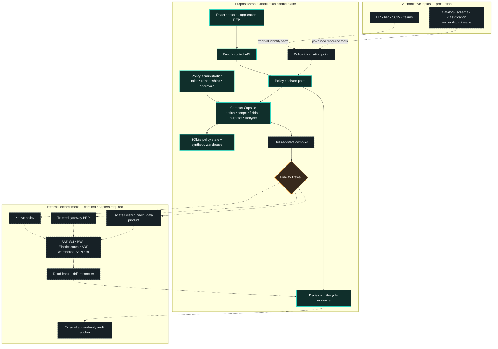

# PurposeMesh architecture

**Purpose-bound access, enforced everywhere.**

## Decision

PurposeMesh's target canonical model should be application-agnostic: not another
directory of target-specific roles and not a proxy that every data byte must
cross. The current repository applies that model to a reference estate and one
minimal application decision adapter; universal target connectivity is not yet
implemented. The durable model is:

> Few stable functional roles + ABAC DataScope + relationship context + an
> atomic portable access contract + target-aware enforcement.

This is intentionally evolutionary. RBAC, ABAC, relationship-aware policy,
PDP/PEP, OIDC, SCIM, row security, and workload identity are established
patterns. PurposeMesh's differentiator is the closed-loop delivery contract: one policy
is evaluated online or compiled natively, refused when enforcement fidelity is
insufficient, and reconciled against actual target state.

## Real enterprise scenario

```text
S/4HANA vendor / purchasing facts
    -> extraction identity
    -> SAP BW process chains and monitoring
    -> Elasticsearch, warehouse, or an ADF-managed destination
    -> team dashboards over a shared source
```

The shared source is not shared authority. Example consumers include:

- Vendor Operations for selected purchasing organizations and plants.
- Finance Controls for selected company codes and audit purposes.
- L1 support for process-chain health without vendor PII.
- L2 BW operators who may inspect and retry selected chains.
- Platform Operations for cross-team technical telemetry without business
  payload.
- Data Stewards who classify and approve but do not automatically read data.
- Platform administrators who maintain PurposeMesh but receive no implicit business-data
  access.

The security boundary must survive direct query, export, API, dashboard, search,
and pipeline paths. A client-side or workbook filter is never a PEP.

### Current staged pipeline model

The local seed now makes the source-to-target trust boundaries explicit rather
than treating the whole chain as one broad service account:

```text
pc.vendor.replicate
  read  S/4 vendor master (restricted)
  write BW vendor replication stage (restricted)
            |
            v
pc.vendor.activate
  read  BW vendor replication stage (restricted)
  write governed BW vendor provider (confidential)
            |
            v
pc.vendor.telemetry
  read  sanitized process-chain status (vendor_id denied)
  write Elasticsearch technical logs
```

Each stage has its own workload principal, capsule, contracts, assignment, and
compiled SPIFFE-shaped desired identity. Tests prove, for example, that the S/4
replicator cannot write the governed provider and that the activation workload
can do only the middle-stage handoff. These are locally evaluated identities and
desired-state strings—not issued SPIFFE credentials or live SAP/BW/Elasticsearch
enforcement.

## Capability truth

### Implemented and locally enforceable

- Untrusted React console calling a Fastify control API.
- Current-principal revalidation and deny-by-default PurposeMesh policy core.
- Personas, capsules, memberships, contracts, bindings, datasets, predicates,
  classification ceilings, field allowlists/denies, JIT state, and audit events.
- Parameterized SQL scope and allow-first projection over the local SQLite
  warehouse.
- Minimal AuthZEN evaluation adapter at `POST /access/v1/evaluation`: strict
  schema, authenticated self-subject by default, governance-admin-only
  cross-subject checks, trusted token-purpose binding, optional dataset record
  lookup, PDP decision, field/contract/capsule obligations, and audit.
- Small hand-authored core records for PDP explanation.
- Single-node durable SQLite control snapshot with rollback on failed writes and
  verified WAL-consistent backup/verify/restore tooling for local recovery.
- Guarded v2→v3 demo/test snapshot migration only for empty-JIT state with
  resolvable membership personas; production refuses automatic migration and
  requires reviewed offline handling.
- Deterministic compiler output with a content-addressed policy hash/version,
  currently eligible human/workload assignments, target artifacts, local
  required/supported/missing capability gates, deployment status, and explicit
  preview state. Seeded target policies are blocked and have empty
  apply/revoke/read-back arrays because full purpose/row fidelity is unavailable.
- Local role requests that require two distinct reviewer roles—warehouse Data
  Owner and Governance Admin—before apply. Either approval may arrive first and
  is retained as partial evidence while the request remains pending; the final
  decision revalidates reviewer authority and SoD before atomic apply.
- Three executable, versioned warehouse separation-of-duty rules, evaluated for
  a candidate plus standing access at request and approval time, with a current
  violation report for governance reviewers.
- Manual recertification for active human memberships, including stable
  assignment identity, eligible-reviewer and self-review checks, attest/revoke,
  last-admin protection, campaign evidence, and stale-assignment detection.
- Local JIT, controlled membership, and capsule-offboarding workflows. Business
  and data memberships have no direct-add path: the API and core return
  `approval_workflow_required`; direct add exists only for explicit
  control-plane administrator recovery.
- Content-addressed approved-role application: only after the request policy
  completes, an action/ceiling capability persona is reused across principals;
  equal purpose/scope capsules and equal contracts are reused; the
  principal-to-capability assignment lives on the membership.
- JIT grants resolved from approval-required bound contracts and frozen with row
  predicate, capsule attributes, classification maximum, fields, actions,
  purpose, assurance context, policy version, and expiry before approval.

### Generated, not enforced externally

- Elasticsearch DLS/FLS role documents.
- BW analysis-authorization-shaped documents.
- BOBJ groups/folders and dashboard spaces.
- SPIFFE identifier and vault-path shapes for a workload capsule.
- A plan schema whose apply, revoke, and read-back arrays intentionally remain
  empty while a required capability is missing.

Elasticsearch preview index names use
`<sanitized-dataset-id>-<12-character-SHA-256-prefix>-*`, not an unhashed
`{dataset}-*` pattern. The same normalized-plus-hash helper is used for native
identifiers so different unsafe inputs cannot collapse silently to one name.

No worker applies these artifacts, reads target state back, reconciles drift, or
proves equivalence in this repository.

### Production target, not implemented

- Enterprise OIDC/BFF, SCIM/HR synchronization, WebAuthn/conditional access, and
  real SPIFFE or cloud-managed workload identity.
- Catalog, schema, owner, classification, lineage, and existing-entitlement
  discovery connectors.
- Broader AuthZEN resource/context coverage, PEP SDKs, and conformance evidence
  beyond the implemented minimal dataset adapter.
- Certified SAP S/4, BW, Elasticsearch, ADF, warehouse, API, Tableau, Power BI,
  or Looker adapters.
- Transactional shared control store, multi-replica PDP, outbox workers,
  normalized append-only state/audit, external immutable anchoring, encrypted
  offsite retention, and regional disaster-recovery automation.
- Generic resource-owner assignments, configurable and approved SoD rule sets,
  scheduled human/workload recertification, notifications, and a defined overdue
  enforcement policy.

## Reference architecture

Solid teal paths are implemented by this repository. Dashed paths describe the
production integration contract and are not claims of live connectivity.



### Trust boundaries

- **Browser:** untrusted. It can request or visualize; it cannot decide, inject a
  trusted team id, or relax returned obligations.
- **Control API / application PEP:** authenticates the current subject, validates
  trusted context, asks the PDP, enforces returned obligations, and logs use.
- **PurposeMesh policy core / PDP:** evaluates canonical policy. It is not an identity provider
  and a valid token alone is not an authorization.
- **PIP and catalog:** supply current identity, relationship, resource,
  classification, and lineage facts with source provenance and freshness.
- **Policy administration point:** versions policy, validates separation of
  duties, simulates impact, and manages approval.
- **Compiler and adapter:** translate approved desired state. They cannot weaken
  a policy to fit a target.
- **Target PEP:** remains the final enforcement point for native access.
- **Reconciler:** compares desired with actual target state. Compiler output is
  not evidence until read-back succeeds.

## Few-role model: RBAC + ABAC + ReBAC

### Stable functional roles

| Role | Capability | Data implication |
|---|---|---|
| Viewer | discover, read, query | DataScope, purpose, classification and projection still apply |
| Operator | monitor, run, retry, cancel | Technical logs by default; payload access is separate |
| Data Steward (governance) | classify, propose, approve data policy, attest | No implicit raw-data access and no self-approval |
| Security Auditor | review decisions, evidence, drift, and control operation | Read-only evidence access; no policy mutation or implicit business-data access |
| Platform Admin | configure PurposeMesh, connectors and deployments | Management plane only; no implicit business-data access |

`export`, unrestricted view, restricted fields, and break-glass are explicit
actions or time-bounded capsules, not additional permanent roles.

The current seed contains more descriptive personas for demonstration. Role
Studio no longer keys objects to a principal: it content-addresses and reuses a
capability persona from actions + ceiling, a capsule from purpose + scope, and a
contract from those objects and field rules. Membership carries the persona for
that relationship plus a stable assignment identity. Nothing is directly
assigned from Role Studio: the frozen draft first becomes a durable request.
This removes duplicate objects for identical drafts, but the current authoring
language can still create many action/ceiling combinations. Production
governance should restrict them to the five approved capability personas and
typed, owner-approved shared scopes.

### Relationships

Relationships provide context without encoding every combination in role names:

```text
member-of(subject, team)
owns(team, data-product)
operates(team, pipeline)
derived-from(target-dataset, source-dataset)
approves(data-steward, data-product)
```

Relationships are not sufficient by themselves. They are evaluated with action,
scope, classification, purpose, and environment.

### Current governance workflow and its boundary

```mermaid
sequenceDiagram
  autonumber
  actor Requester
  participant API as PurposeMesh API
  participant SoD as SoD evaluator
  actor Owner as Data Owner
  actor Admin as Governance Admin
  participant Store as Durable policy store

  Requester->>API: Submit frozen role request
  API->>SoD: Validate standing + candidate access
  SoD-->>API: Pass or deny with evidence
  API->>Store: Persist pending request
  Note over Requester,Store: No access changes at submission
  Owner->>API: First independent review
  API->>Store: Record partial approval
  Note over Requester,Store: First review still grants nothing
  Admin->>API: Second independent review
  API->>SoD: Recheck people, authority, target, and SoD
  alt Any check fails
    API-->>Requester: Deny; membership unchanged
  else Every check passes
    API->>Store: Apply reusable policy + new assignmentId
    API-->>Requester: Approved with audit evidence
  end
```

The requester and target cannot review, one identity cannot satisfy both roles,
creation fails when a distinct independent pair is unavailable, and either
reviewer can deny. `POST /api/roles/apply` is deliberately fail-closed and always
returns `approval_workflow_required`; only completion of the durable request
calls the internal apply operation.

The seed makes both authorship paths testable. A non-reviewer can submit a
self-request, which `dana.owner` and either `hugo.admin` or `iris.admin` review.
For a cross-target request authored in Role Studio by one administrator, Dana
and the other administrator review it; the author remains ineligible. Both
administrators have control-plane membership with classification ceiling
`none`, so the second reviewer does not gain business-data access.

The executable policy is intentionally narrow. “Data Owner” currently means the
exact `data-owner` persona in the `data-governance-owner` capsule, not an owner
resolved from an arbitrary dataset. The three versioned SoD rules are code
constants for the reference warehouse: vendor-master operation cannot combine
with financial-transaction operation; an audit-purpose fact cannot combine with
operation; and a data-governance-purpose fact cannot combine with operation.
This demonstrates enforcement and evidence, but production must persist
resource-specific owner relationships and configurable, governed rule versions.

Recertification is a manual review queue over active **human** memberships. Each
campaign item captures principal, capsule, persona, and membership
`assignmentId`; its membership fingerprint hashes those four values, while
decision evidence also records the resulting audit sequence/hash. If the
assignment is removed or re-granted, the old item becomes
`removed` and cannot attest the replacement. Reviewer eligibility is role-aware,
self-review is forbidden, and revoke uses the same last-admin safeguard as
ordinary lifecycle removal.

`cadenceDays` and `nextCampaignAt` are planning/evidence values only. There is no
scheduler or notification worker. Campaign state is refreshed lazily when a
recertification API is called; after `dueAt`, an active campaign with pending
items becomes `expired` and accepts no more decisions, but pending memberships
remain authorized. Workload identities are not included. A production policy
must define scheduling, escalation/grace, automatic or manually approved overdue
action, and workload ownership before calling this periodic enforcement.

## Canonical entities

### Subject

```json
{
  "id": "user-1042",
  "type": "human",
  "status": "active",
  "tenant": "enterprise-a",
  "functionalRoles": ["viewer"],
  "teamIds": ["vendor-ops-us"],
  "clearance": "confidential",
  "assuranceLevel": 2,
  "attributeSource": "corporate-idp",
  "attributesValidUntil": "2026-08-17T00:00:00Z"
}
```

### Resource

```json
{
  "urn": "urn:cca:prod:bw:data-product/vendor-chain-runs",
  "type": "dataset",
  "owner": "vendor-data-office",
  "tenant": "enterprise-a",
  "source": "S4-PRD",
  "target": "BW-PRD",
  "scopeDimensions": ["company_code", "purchasing_org", "plant"],
  "classification": "confidential",
  "lineage": ["S4-PRD", "BW-PRD", "ES-VENDOR-MONITOR"]
}
```

### DataScope

DataScope is a typed row-domain contract, independent of a job role:

```json
{
  "tenant": "enterprise-a",
  "products": ["process_chains", "bw_vendor"],
  "companyCodes": ["1000"],
  "purchasingOrganizations": ["US01", "US02"],
  "plants": ["TX01"],
  "regions": ["NA"],
  "classificationMax": "confidential"
}
```

The current warehouse `DataScope` is narrower: product, tenant, region,
department, source, ceiling, deny fields, and capsule/contract identifiers. The
additional SAP dimensions above are the target evolution, not current fields.

### Contract Capsule

An access capsule is atomic. Its row predicate and field release must not be
flattened independently when several grants apply.

```json
{
  "subjectSelector": { "team": "vendor-ops-us", "role": "viewer" },
  "resource": "urn:cca:prod:bw:data-product/vendor-chain-runs",
  "actions": ["read"],
  "purpose": "operations",
  "scope": {
    "tenant": "enterprise-a",
    "purchasingOrganizations": ["US01", "US02"]
  },
  "fields": {
    "allow": ["chain_id", "run_id", "status", "records_loaded"],
    "mask": { "vendor_id": "last4" },
    "deny": ["raw_error_payload", "bank_account", "tax_identifier"]
  },
  "conditions": { "minimumAssurance": 2 },
  "obligations": ["audit", "no-export"],
  "validUntil": "2026-11-01T00:00:00Z"
}
```

The current model supports purpose, actions, dataset, allowed personas,
classification maximum, row predicate, dataset/contract allowlists, field denies,
membership-level capability persona and assignment identity, bindings, and
lifecycle. Compiler and JIT artifacts have deterministic policy hashes/versions,
but a signed global policy release is not implemented. Standing memberships do
not yet have general `validFrom`/`validUntil` leases; recertification is not a
substitute for an enforced lease. Field-mask transformations, environment
conditions, general relationship rules, and general obligations remain target
capabilities.

## AuthZEN and application integration

The implemented reference adapter uses the OpenID Authorization API 1.0 request
envelope:

```json
{
  "subject": { "type": "user", "id": "emma.acme" },
  "action": { "name": "view" },
  "resource": {
    "type": "dataset",
    "id": "bw_vendor"
  },
  "context": {
    "purpose": "vendor-performance",
    "recordId": "bw-1"
  }
}
```

The standard envelope makes PEP/PDP communication portable. The current API
implements a deliberately small reference adapter at
`POST /access/v1/evaluation`. It accepts a user/workload subject, a canonical action, a
dataset resource, and context containing trusted purpose plus optional
`recordId`. Non-admin callers may evaluate only themselves; a governance admin
may evaluate another subject. For self-evaluation, the endpoint binds purpose to
the verified token; a purpose-scoped cross-subject token must instead be
governance-scoped. It looks up records server side, delegates to the canonical
PDP, defaults to deny, audits the result, and returns allow/deny plus allowed
fields, denied fields, contract ids, capsule ids, and a JIT policy version when
applicable.

This is a reference application adapter, not a claim of ecosystem-wide AuthZEN
conformance. Rich resource types, general DataScope and mask/no-export/max-row
obligations, batched/search evaluation, PEP SDKs, conformance suites, and the
production identity boundary remain target work. A PEP may release data only
after applying every mandatory obligation.

## Data knowledge, classification, and lineage

PurposeMesh can only decide over facts it knows. Production requires connector-driven
inventory:

1. Harvest systems, datasets, indexes, BW objects, semantic models, dashboards,
   schemas, fields, existing permissions, and access paths.
2. Record source-to-target lineage and ownership.
3. Classify fields through deterministic rules and scanning; treat inferred tags
   as candidates.
4. Require the accountable data owner to confirm classification, permitted
   purposes, and scope dimensions.
5. Publish the resource only after the adapter capability gate passes.
6. Re-scan and reconcile schema, lineage, labels, and permissions continuously.

Unregistered or unclassified data is restricted or quarantined. Classification
automation may recommend but never auto-grant. Identity attributes come from an
authoritative source; behavior analytics cannot silently infer entitlement.

## Sample monitoring data product

`vendor_process_chain_run` should be curated separately from raw replication
payload:

| Field | Class | Use |
|---|---|---|
| `tenant_id` | security | Mandatory isolation guard |
| `company_code`, `purchasing_org`, `plant` | internal | Business scope dimensions |
| `chain_id`, `run_id`, source, target | internal | Process identity and lineage |
| status, start/end time, extracted/loaded counts | internal | Operations dashboards |
| `vendor_id`, `vendor_name` | confidential | Mask or release by purpose |
| `error_message_sanitized` | internal | Operator diagnosis |
| `raw_error_payload` | restricted | Separate break-glass resource |
| credentials, tokens, secrets | prohibited | Reject or quarantine before ingest |

Example access matrix:

| Principal | Rows | Fields | Actions |
|---|---|---|---|
| Vendor Ops US | `tenant=A AND purchasing_org IN (US01,US02)` | Operational fields; vendor id masked | view |
| L2 BW | Assigned chains/company codes | Technical detail; payload denied | view, run, retry |
| Platform Ops | All chain health | No vendor identity or raw payload | monitor, operate |
| Finance Audit | Approved company codes | Clear vendor id only during JIT case | view; export separately approved |
| Platform Admin | No business rows by default | Metadata only | administer |

## Decision semantics

For ordinary data access:

1. Authenticate the current human or workload and reject inactive/stale identity.
2. Require an active capsule/team relationship.
3. Require the functional role to permit the action.
4. Resolve the registered resource, lineage, owner, labels, and target capability.
5. Require exact trusted purpose.
6. Apply mandatory tenant guard and DataScope predicate.
7. Enforce both contract and persona classification ceilings.
8. Apply allow-first fields, masks, explicit denies, and other obligations.
9. Return an allow only if the PEP can enforce the complete result.
10. Log subject, action, resource, purpose, decision, reason, policy version,
    obligations, and target proof.

Global tenant, active-state, classification, and explicit-deny guards always win.
Alternative allow capsules may be additive, but the compiler must preserve each
row/field pair. A target that would cross-product one role's rows with another
role's columns fails the fidelity gate.

## Fidelity firewall and adapter contract

The current compiler has a useful local pre-deployment gate. For each candidate
artifact it records required, supported, and missing capabilities from
`classification_ceiling`, `row_filter`, `field_allowlist`, `field_denylist`,
`purpose_binding`, and `workload_identity`. A native-shaped artifact may still be
shown for review, but any missing requirement makes deployment `blocked`, sets
`previewOnly`, and leaves apply/revoke/read-back arrays empty. It also emits a
policy hash/version and eligible assignments. Those facts describe the local
compiler's hard-coded target model. They do **not** discover an installed target's
version/edition or prove that a target applied the policy.

Every production adapter must additionally publish a version-specific capability
manifest:

| Capability | Required declaration |
|---|---|
| Resource/action | Native, gateway, projection, or unsupported |
| Row predicate | Supported operators and value limits |
| Field projection | Allowlist/deny semantics and role-combination behavior |
| Masking | Supported transformations and irreversible options |
| Context/JIT | Online check, compiled lease, or unsupported |
| Revocation | Expected propagation and confirmation mechanism |
| Audit | Decision/use/read-back evidence available |

Deployment choices are ordered: exact native policy, trusted gateway PEP,
isolated view/index/data product, then block. Silent degradation is prohibited.

A certified adapter is complete only when it supports:

1. deterministic plan and diff;
2. idempotent apply and revoke;
3. read-back verification;
4. drift detection and safe retry;
5. bounded failure handling and rollback;
6. version/edition-specific capability tests;
7. canonical-PDP versus target-result equivalence tests.

## Platform enforcement map

| Platform | Correct enforcement | Caveat |
|---|---|---|
| S/4HANA | PFCG/authorization objects for functions; CDS DCL for instance access; narrow extraction identity | PurposeMesh emits no live S/4 policy today |
| BW/4HANA | Standard authorization for modeling/loading; analysis authorization for authorization-relevant characteristics; `S_RS_PC`/`S_RS_ADMWB` for process-chain actions | Native process monitor may need a governed query/data product for field isolation |
| Elasticsearch | Index privileges plus read-only DLS/FLS | Multiple roles can widen access; sensitive cohorts may require separate indexes |
| ADF | Azure management RBAC and one managed identity per pipeline/data product | ADF is orchestration, not row-level end-user security; source/target must enforce data scope |
| Warehouse | Native RLS/CLS/masking or governed views | Owner/superuser bypass and unsupported predicates must be tested |
| Power BI | Semantic-model RLS/OLS and consumer Read/Viewer access | Write/Contributor/Member/Admin paths can bypass RLS; creators need segregated workspaces |
| API/basic app | Implemented minimal `POST /access/v1/evaluation` reference adapter over the canonical PDP | Currently dataset + purpose + optional record id; PEP must apply returned field obligations, and broader SDK/conformance work remains |

The current compilers cover only selected Elasticsearch, BW, BOBJ/dashboard, and
workload-identity-shaped preview JSON plus local capability gates. Seeded
target-bearing policies remain blocked with empty execution plans. The broader
matrix and connector-executed read-back are target design.

## Identity and workload authentication

Authentication proves who is calling; it never grants data access by itself.

- Humans: enterprise OIDC/BFF, Authorization Code + PKCE, phishing-resistant MFA,
  exact redirect validation, step-up for privileged actions, short sessions, and
  current server-side authorization state.
- Workloads: cloud managed identity or SPIFFE/SPIRE short-lived X.509 identity;
  narrow SAP communication identity where legacy integration requires it.
- Legacy secrets: vault, owner, expiry, rotation, audience restriction, and no
  sharing between pipelines.

The current repository has demo scrypt passwords and an HS256 production token
validation contract only. The issuer-authenticated token carries a validated
`password`, `mfa`, or `phishing-resistant` assurance value, which the server—not
the request body—records in JIT request/approval context. That is useful policy
context, but it is not proof that this repository performed MFA. It does not
implement OIDC, SCIM, WebAuthn, DPoP, managed identity, SPIFFE issuance, or
certificate rotation.

The signed token also carries a required 64-hex authorization fingerprint over
the principal's exact live membership assignment ids, personas, and capsules.
Every protected request recomputes it from current server-side state. Removing an
assignment invalidates the token immediately; re-granting the same capsule has a
new assignment id and cannot make the old token valid again.

The React client stores its bearer token in tab-scoped `sessionStorage`, deletes
the legacy `localStorage` token, warns before expiry, clears the session at
expiry/401, and preserves only the unfinished role draft in that tab. The API
adds `no-store`, `nosniff`, and `no-referrer`; the local HTML entry point installs
a baseline document-level Content Security Policy, but same-origin JavaScript can
still read the token. The production browser boundary is therefore OIDC through a
BFF, server-managed refresh/revocation, `HttpOnly`/`Secure`/`SameSite` cookies,
and a restrictive CSP delivered and tested as an HTTP response header.

## Lifecycle

```mermaid
flowchart LR
  REQUEST["Request"] --> VALIDATE["Validate + simulate + SoD"]
  VALIDATE --> REVIEW1["First required review<br/>partial evidence only"]
  REVIEW1 --> REVIEW2["Second distinct review<br/>live authority recheck"]
  REVIEW2 --> ASSIGN["Local assignment<br/>new assignmentId"]
  ASSIGN --> DECIDE["PDP enforcement"]
  ASSIGN --> COMPILE["Compile desired state"]
  COMPILE -. "certified target only" .-> APPLY["Apply + read back"]
  APPLY -.-> ACTIVE["Verified external state"]
  DECIDE --> REVIEW["Recertify / expire / revoke / offboard"]
  ACTIVE -.-> REVIEW
  REVIEW --> DENY["Immediate local deny"]
  REVIEW -. "connector required" .-> REMOVE["Target removal + read-back"]
  DENY --> EVIDENCE["Audit evidence"]
  REMOVE -.-> EVIDENCE

  classDef current fill:#102f2b,stroke:#2dd4bf,color:#f7fbfa,stroke-width:2px;
  classDef future fill:#172126,stroke:#809196,color:#e7eeee,stroke-dasharray:5 4;
  class REQUEST,VALIDATE,REVIEW1,REVIEW2,ASSIGN,DECIDE,REVIEW,DENY,EVIDENCE current;
  class COMPILE,APPLY,ACTIVE,REMOVE future;
```



Onboarding originates in authoritative HR/IdP state, then team/scope assignment,
owner approval, policy simulation, native deployment, and verification.

Offboarding a team must:

1. mark the team/capsule inactive so online decisions deny;
2. revoke sessions/refresh and update authorization epoch;
3. remove directory membership and native assignments;
4. expire JIT and access leases;
5. disable or transfer team-owned workload identities;
6. reconcile every target to zero residual grants;
7. emit signed completion evidence.

The current local offboard operation completes steps in desired state and returns
pre-removal compiler previews. Because target fidelity is blocked, these do not
form an executable external revoke plan; without live connectors PurposeMesh cannot prove
external removal.

The current local recertification operation can attest or remove the exact human
membership assignment captured by a campaign. It is manually created/renewed,
does not schedule itself, excludes workloads, and does not revoke unresolved
access merely because a deadline passed.

## Robustness and availability target

The repository now has a verified single-node backup tool: SQLite online backup
captures committed WAL state; verification uses the production parser and checks
hashes, object counts, relationships, and the local audit chain; restore requires
stopped-writer confirmation, creates a rollback bundle for an existing target,
and verifies the committed result. Every existing path component is checked with
`lstat` and symlinks are rejected. This is local recovery, not offsite DR.

The same snapshot design has explicit scale and integrity limits. It embeds the
complete audit chain and serializes the entire JSON envelope on persisted audited
operations, so copy/write cost grows with history. The local unkeyed SHA-256
chain detects edits only relative to the retained mutable snapshot; a writer can
replace or truncate the snapshot and recompute it. A manifest stored with a
backup detects corruption but is not an independent immutable anchor.

The production target therefore requires:

- Stateless PDP/API replicas across failure domains.
- Transactional policy store with constraints, migrations, optimistic concurrency,
  and an outbox feeding connector workers.
- Normalized append-only audit events and signed/KMS or WORM head checkpoints
  verified independently of mutable application state.
- Signed, immutable policy versions and last-known-good bundles.
- External append-only audit and target proof store.
- Bounded decision caches keyed by subject, tenant, resource, action, purpose,
  policy version, and authorization epoch.
- Fail closed for restricted data, writes, export, and governance. Any lower-risk
  cached-read behavior must be explicit, short lived, and tested.
- Health checks distinguish liveness, storage readiness, identity freshness,
  connector lag, and drift.
- Encrypted offsite backup retention, legal hold, automated restore rehearsal,
  key rotation, regional recovery, and chaos exercises.

No availability or revocation SLA should be claimed before measurement against
the real IdP and target platforms.

## Delivery roadmap

1. **Policy foundation:** five reusable capability personas, typed DataScope, relationship
   graph, signed policy versions, and fixed JIT non-bypass invariants.
2. **Identity and catalog:** enterprise OIDC/SCIM, workload identity, governed
   resource inventory, ownership, classification, and lineage.
3. **One end-to-end pilot:** S/4 -> BW vendor process monitoring -> one target
   store -> one BI model, with Vendor Ops, L2, Platform Ops, and JIT Audit.
4. **First certified adapter:** plan, apply/revoke, read-back, drift, rollback,
   and cross-target equivalence. The warehouse is the simplest first PEP.
5. **SAP/Elasticsearch/ADF/BI adapters:** add only after the adapter SDK and
   fidelity tests are stable.
6. **Enterprise hardening:** multi-replica state, outbox, immutable audit,
   disaster recovery, scale testing, threat modeling, and red-team review.

## Standards and primary platform references

- NIST RBAC model: <https://csrc.nist.gov/Projects/role-based-access-control/faqs>
- NIST ABAC SP 800-162: <https://csrc.nist.gov/pubs/sp/800/162/upd2/final>
- NIST Zero Trust SP 800-207: <https://csrc.nist.gov/pubs/sp/800/207/final>
- NIST security and privacy controls SP 800-53 Rev. 5: <https://csrc.nist.gov/pubs/sp/800/53/r5/upd1/final>
- OpenID Authorization API 1.0: <https://openid.net/specs/authorization-api-1_0.html>
- OAuth 2.0 Security BCP, RFC 9700: <https://www.rfc-editor.org/rfc/rfc9700.html>
- SCIM protocol, RFC 7644: <https://www.rfc-editor.org/rfc/rfc7644.html>
- SPIFFE workload identity: <https://spiffe.io/docs/latest/spiffe/concepts/>
- SAP BW authorizations: <https://help.sap.com/docs/SAP_BW4HANA/107a6e8a38b74ede94c833ca3b7b6f51/4a4ce95baef40451e10000000a421937.html>
- SAP process-chain authorizations: <https://help.sap.com/docs/SAP_BPC_VERSION_BW4HANA/dd104a87ab9249968e6279e61378ff66/4a2c5023c16d47dbe10000000a42189c.html>
- Elasticsearch DLS/FLS: <https://www.elastic.co/docs/deploy-manage/users-roles/cluster-or-deployment-auth/controlling-access-at-document-field-level>
- Azure Data Factory security: <https://learn.microsoft.com/en-us/azure/data-factory/secure-your-azure-data-factory>
- Power BI consumer security: <https://learn.microsoft.com/en-us/power-bi/guidance/powerbi-implementation-planning-security-report-consumer-planning>
- OWASP Session Management Cheat Sheet: <https://cheatsheetseries.owasp.org/cheatsheets/Session_Management_Cheat_Sheet.html>
- OWASP Content Security Policy Cheat Sheet: <https://cheatsheetseries.owasp.org/cheatsheets/Content_Security_Policy_Cheat_Sheet.html>
